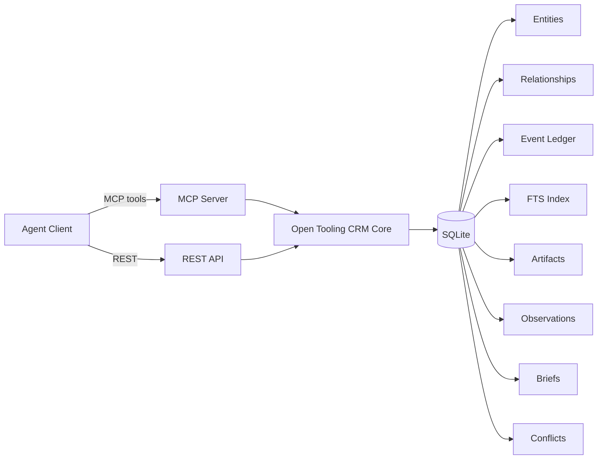

# Open Tooling CRM

**The CRM where agents are the UI.**

Open-source, local-first CRM built for AI agents. Fully configurable to your workflow.
SQLite-backed. REST API + MCP server. Evidence-first memory.

<!-- badges -->
[](https://github.com/Attri-Inc/open-tooling/actions)
[](https://github.com/Attri-Inc/open-tooling)
[](LICENSE)
[](https://modelcontextprotocol.io)

<!-- TODO: Add 30-second demo GIF here showing Claude Desktop using Open Tooling CRM MCP tools -->
<!-- Record with Rekort or asciinema: create contact → ingest email → extract observations → generate brief -->

> Part of [Open Tooling](https://github.com/Attri-Inc/open-tooling) — AI-native open-source SaaS tools.

---

## Why Open Tooling CRM?

Traditional CRMs are built for humans clicking buttons. AI agent frameworks are built for orchestration, not data persistence. Open Tooling CRM fills the gap: a system of record designed from the ground up for agents.

| | **Open Tooling CRM** | **Twenty** | **Salesforce** | **SuiteCRM** |
|---|---|---|---|---|
| **Built for** | AI agents | Humans | Humans | Humans |
| **Architecture** | Headless API + MCP | Full UI + GraphQL | Full UI + API | Full UI + API |
| **Memory model** | Evidence chain (artifacts → observations → briefs → conflicts) | Standard fields | Standard fields | Standard fields |
| **Provenance** | Field-level source tracking | None | None | None |
| **Self-corrections** | First-class (supersede / retract) | Overwrite | Overwrite | Overwrite |
| **MCP native** | 27 tools | No | No | No |
| **Self-hosted** | SQLite, zero dependencies | Postgres required | Cloud only | LAMP stack |
| **License** | Apache 2.0 | AGPL 3.0 | Proprietary | AGPL 3.0 |

---

## Quick Start

```bash
npm install
cp .env.example .env
npm run dev
```

Server starts at `http://localhost:8787`.

```bash
npm run seed    # Populate with sample CRM data
```

### Run with Docker

```bash
docker compose up --build
```

Data persists in a named volume (`crm-data`).

---

## Built for the Agent Era

Open Tooling CRM is designed around five pillars:

### 1. Agent-First
No human UI. The REST API (29 endpoints) and MCP server (27 tools) are the only interfaces. Agents don't need buttons — they need structured, typed, deterministic access to data.

### 2. Evidence-First Memory
Every claim traces back to raw evidence. The memory layer follows a structured chain: **Artifacts** (raw evidence like emails and transcripts) → **Observations** (typed claims with lifecycle management) → **Briefs** (derived summaries citing observations) → **Conflicts** (explicit disagreement records). No opaque summaries. No hallucination-friendly black boxes.

### 3. Local-First
SQLite-backed, zero cloud dependencies. Runs on your machine or self-hosts on your own infrastructure (GCP, AWS, etc.) at a fraction of per-seat SaaS costs. Your data stays yours.

### 4. MCP-Native
Designed for the Model Context Protocol ecosystem. 27 tools purpose-built for Claude Desktop, Claude Code, and any MCP-compatible client. Plug-and-play with the fastest-growing agent integration standard.

### 5. Composable & Configurable
Pure data layer — bring your own agents, LLMs, and workflows. Works with LangChain, CrewAI, AutoGen, or custom agents. Configure entity types, properties, and integrations for your specific domain. A masonry contractor tracks projects and bids; a SaaS company tracks accounts and ARR. Same core, different configuration.

---

## Architecture



Both interfaces share the same core. All writes produce immutable events in the ledger. All data is Zod-validated. All list endpoints return paginated responses.

---

## MCP Server (Claude Desktop / Claude Code)

```bash
npm run mcp
```

Add to your MCP client config:

```json
{
  "mcpServers": {
    "open-tooling-crm": {
      "command": "/absolute/path/to/open-tooling/crm/node_modules/.bin/tsx",
      "args": ["/absolute/path/to/open-tooling/crm/src/mcp.ts"],
      "env": {
        "CRM_DB_PATH": "/absolute/path/to/open-tooling/crm/data/crm.db"
      }
    }
  }
}
```

### MCP Tools (27)

**Entities:** `create_entity`, `update_entity`, `get_entity`, `search_entities`, `archive_entity`

**Relationships:** `link_entities`, `unlink_entities`, `list_relationships`, `traverse_graph`

**History:** `get_entity_history`

**Artifacts:** `ingest_artifact`, `get_artifact`, `list_artifacts`

**Observations:** `add_observation`, `get_observation`, `list_observations`, `supersede_observation`, `retract_observation`

**Briefs:** `create_brief`, `get_brief`, `list_briefs`

**Conflicts:** `create_conflict`, `get_conflict`, `list_conflicts`, `resolve_conflict`

**Data:** `export_data`, `import_data`

---

## Data Model

### Entities
Typed records: `contact`, `company`, `deal`, `interaction`, `task`, `agent`. JSON properties, status tracking, optional confidence and verification scores.

### Relationships
Directed edges between entities: `EMPLOYED_AT`, `ASSOCIATED_WITH`, `OWNS`, `INTERACTED_WITH`, `CREATED_BY`, `RELATED_TO`.

### Memory Layer

| Primitive | Purpose |
|-----------|---------|
| **Artifact** | Raw, immutable evidence (email, call transcript, meeting notes, document, note) |
| **Observation** | Typed claim extracted from an artifact. Lifecycle: `current` → `superseded` / `retracted` |
| **Brief** | Derived summary citing observations. Always regeneratable from evidence |
| **Conflict** | Explicit record when observations disagree. Requires resolution |

### Supporting

- **Event Ledger** — append-only audit trail for every mutation, with actor context
- **Field Provenance** — per-field source tracking
- **FTS Index** — full-text search across entity properties

---

## REST API

| Method | Endpoint | Description |
|--------|----------|-------------|
| `GET` | `/health` | Health check |
| `POST` | `/entities` | Create entity |
| `GET` | `/entities/:id` | Get entity (optional `?include_field_provenance=true`) |
| `PATCH` | `/entities/:id` | Update entity (merge or replace properties) |
| `DELETE` | `/entities/:id` | Archive entity |
| `POST` | `/relationships` | Create relationship |
| `GET` | `/relationships` | List relationships (`?entity_id=&type=`) |
| `DELETE` | `/relationships/:id` | Delete relationship |
| `GET` | `/search` | Search entities (`?type=&q=&filters=&sort=&order=&limit=&offset=`) |
| `GET` | `/graph` | Graph traversal (`?entity_id=&depth=&direction=&type=`) |
| `GET` | `/events` | Event history (`?entity_id=`) |
| `POST` | `/artifacts` | Ingest artifact |
| `GET` | `/artifacts/:id` | Get artifact |
| `GET` | `/artifacts` | List artifacts (`?artifact_type=`) |
| `POST` | `/observations` | Add observation |
| `GET` | `/observations/:id` | Get observation |
| `GET` | `/observations` | List observations (`?entity_id=&lifecycle=`) |
| `PATCH` | `/observations/:id/supersede` | Supersede observation |
| `PATCH` | `/observations/:id/retract` | Retract observation |
| `POST` | `/briefs` | Create brief |
| `GET` | `/briefs/:id` | Get brief |
| `GET` | `/briefs` | List briefs (`?entity_id=&brief_type=`) |
| `POST` | `/conflicts` | Create conflict |
| `GET` | `/conflicts/:id` | Get conflict |
| `GET` | `/conflicts` | List conflicts (`?entity_id=&status=`) |
| `PATCH` | `/conflicts/:id/resolve` | Resolve conflict |
| `GET` | `/export` | Export all data |
| `POST` | `/import` | Import data |

All list endpoints return paginated responses: `{ items, total, limit, offset, has_more }`.

Write endpoints support idempotency via `idempotency-key` header.

---

## Development

```bash
npm run dev          # Start REST API with hot reload
npm run mcp          # Start MCP server (stdio)
npm test             # Run tests (61 passing)
npm run test:watch   # Run tests in watch mode
npm run build        # TypeScript compile
npm run seed         # Populate with sample data
```

## Project Structure

```
src/
  config.ts    — Environment config (PORT, CRM_DB_PATH)
  models.ts    — TypeScript interfaces
  schemas.ts   — Zod validation schemas
  db.ts        — SQLite data layer (all CRUD + FTS + graph)
  http.ts      — HTTP helpers (actor context, idempotency)
  server.ts    — Express REST API
  mcp.ts       — MCP stdio server
```

---

## License

Apache 2.0
