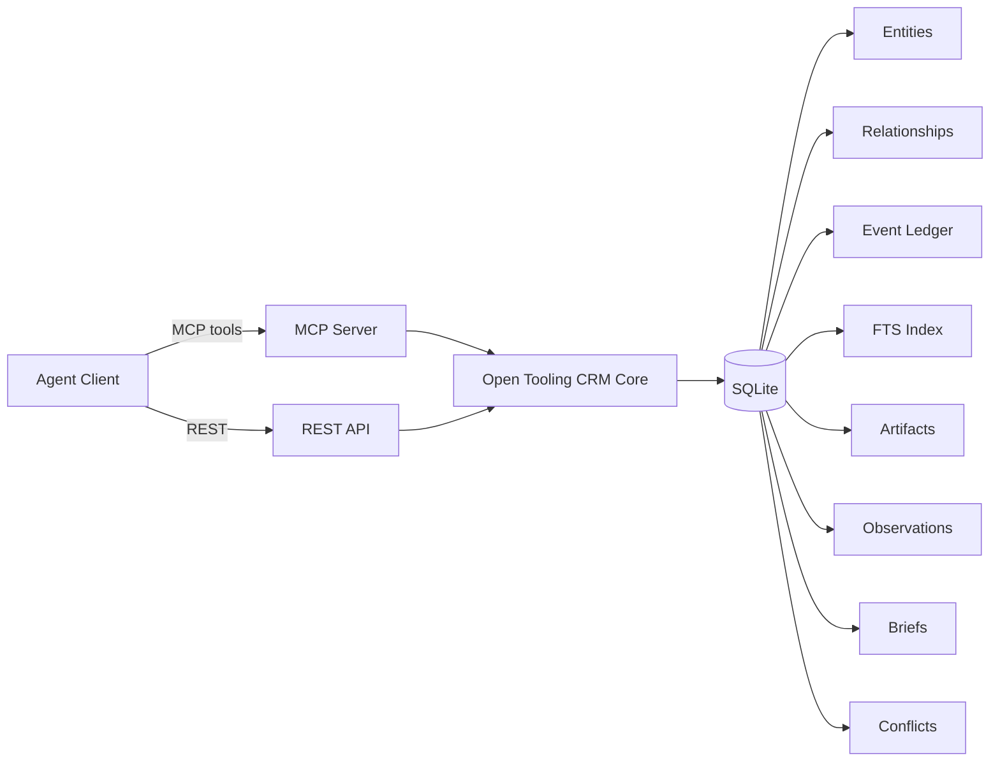

# Open Tooling CRM

**Enterprise SaaS was built for humans. AI agents need new infrastructure.**

Open-source, agent-first CRM with evidence-based memory, 27 MCP tools, and zero vendor lock-in. Every claim has receipts.

<!-- badges -->
[](https://github.com/Attri-Inc/open-tooling/actions)
[](https://github.com/Attri-Inc/open-tooling)
[](LICENSE)
[](https://modelcontextprotocol.io)

<!-- TODO: Add 30-second demo GIF here showing Claude Desktop using Open Tooling CRM MCP tools -->
<!-- Record with Rekort or asciinema: create contact → ingest email → extract observations → generate brief -->

> Part of [Open Tooling](https://github.com/Attri-Inc/open-tooling) — AI-native open-source SaaS tools. See also: [Claude plugin marketplace](https://github.com/Attri-Inc/open-tooling-plugins).

---

## The Problem

Traditional CRMs are built for humans clicking buttons in a web app. AI agents need structured, typed, deterministic access to data. They need to ingest raw evidence — emails, transcripts, documents — and extract verifiable claims. They need to know *why* they believe something, not just *what* they believe.

Bolting AI features onto a human-first architecture doesn't fix the fundamental mismatch.

## The Solution

Open Tooling CRM is a system of record designed from the ground up for AI agents. No UI. No cloud. Just a clean data layer with evidence-based memory and two interfaces: a REST API and an MCP server.

| | **Open Tooling CRM** | **Twenty** | **Salesforce** | **SuiteCRM** |
|---|---|---|---|---|
| **Built for** | AI agents | Humans | Humans | Humans |
| **Architecture** | Headless API + MCP | Full UI + GraphQL | Full UI + API | Full UI + API |
| **Memory model** | Evidence chain (artifacts → observations → briefs → conflicts) | Standard fields | Standard fields | Standard fields |
| **Provenance** | Field-level source tracking | None | None | None |
| **Self-corrections** | First-class (supersede / retract) | Overwrite | Overwrite | Overwrite |
| **MCP native** | 27 tools | No | No | No |
| **Self-hosted** | SQLite, zero dependencies | Postgres required | Cloud only | LAMP stack |
| **License** | Apache 2.0 | AGPL 3.0 | Proprietary | AGPL 3.0 |

---

## Quick Start

```bash
npm install
cp .env.example .env
npm run dev          # REST API at localhost:8787
npm run seed         # Sample data (optional)
```

### With Docker

```bash
docker compose up --build
```

### With Claude (Recommended)

Install the [Open Tooling CRM plugin](https://github.com/Attri-Inc/open-tooling-plugins) for Claude Cowork or Claude Code. Run `/crm-setup` and Claude handles everything — clone, install, seed, MCP wiring. Or just ask Claude to "use Open Tooling CRM" and it kicks off setup automatically.

---

## Evidence-Based Memory

This is the core differentiator. Instead of flat fields that get overwritten, Open Tooling CRM uses a structured evidence chain:

```
Artifacts (raw evidence: emails, transcripts, documents)
    ↓ extraction
Observations (typed claims with lifecycle: current → superseded / retracted)
    ↓ derivation
Briefs (summaries that cite observations — always regeneratable)
    ↓ detection
Conflicts (when observations disagree — never silently resolved)
```

When an agent says "the deal is worth $250K," you can trace that claim through the observation to the exact email where the prospect confirmed it. When the budget changes, the old observation is superseded, not deleted. The audit trail is preserved.

**Progressive retrieval:** Agents start with a brief and drill down to raw evidence only when needed — keeping context windows lean while maintaining full traceability.

---

## Architecture



Both interfaces share the same core. All writes produce immutable events in the ledger. All data is Zod-validated. All list endpoints return paginated responses.

---

## MCP Server (27 Tools)

```bash
npm run mcp
```

Add to your MCP client config:

```json
{
  "mcpServers": {
    "open-tooling-crm": {
      "command": "/absolute/path/to/open-tooling/crm/node_modules/.bin/tsx",
      "args": ["/absolute/path/to/open-tooling/crm/src/mcp.ts"],
      "env": {
        "CRM_DB_PATH": "/absolute/path/to/open-tooling/crm/data/crm.db"
      }
    }
  }
}
```

> **Easier way:** Install the [Claude plugin](https://github.com/Attri-Inc/open-tooling-plugins) and run `/crm-setup` — it auto-configures the MCP server for you.

**Entities:** `create_entity`, `update_entity`, `get_entity`, `search_entities`, `archive_entity`

**Relationships:** `link_entities`, `unlink_entities`, `list_relationships`, `traverse_graph`

**History:** `get_entity_history`

**Artifacts:** `ingest_artifact`, `get_artifact`, `list_artifacts`

**Observations:** `add_observation`, `get_observation`, `list_observations`, `supersede_observation`, `retract_observation`

**Briefs:** `create_brief`, `get_brief`, `list_briefs`

**Conflicts:** `create_conflict`, `get_conflict`, `list_conflicts`, `resolve_conflict`

**Data:** `export_data`, `import_data`

---

## Configure It To Your Workflow

Open Tooling CRM is a universal foundation, not a finished product. Define your entity types and properties, wire up your integrations, deploy for your domain.

A masonry contractor tracks projects, bids, and superintendents. A SaaS company tracks accounts, ARR, and renewal dates. A recruiting firm tracks candidates, roles, and placements. The data model is the same — typed entities with JSON properties, relationships, and an evidence layer — but the configuration is entirely yours.

---

## Intentionally Headless

No bundled UI is a deliberate architectural choice. Traditional CRMs couple their data layer to a rigid frontend. Open Tooling inverts this: the data layer and agent tooling are the product. The interface is whatever you want.

**Three ways to use it:**

1. **Agent-only.** Connect the MCP server to Claude Desktop or any MCP client. Your CRM interface is natural language.
2. **Vibe-code a frontend.** Tell Claude or Cursor: "Build me a React dashboard for my deals pipeline using the Open Tooling CRM API at localhost:8787." The API is conventional enough that any code-gen tool can scaffold a working UI in minutes.
3. **Integrate into your stack.** It's a REST API with 29 endpoints — connect it to anything.

---

## Data Model

### Entities
Typed records: `contact`, `company`, `deal`, `interaction`, `task`, `agent`. JSON properties, status tracking, optional confidence and verification scores.

### Relationships
Directed edges: `EMPLOYED_AT`, `ASSOCIATED_WITH`, `OWNS`, `INTERACTED_WITH`, `CREATED_BY`, `RELATED_TO`.

### Memory Layer

| Primitive | Purpose |
|-----------|---------|
| **Artifact** | Raw, immutable evidence (email, call transcript, meeting notes, document, note) |
| **Observation** | Typed claim extracted from an artifact. Lifecycle: `current` → `superseded` / `retracted` |
| **Brief** | Derived summary citing observations. Always regeneratable from evidence |
| **Conflict** | Explicit record when observations disagree. Requires resolution |

### Supporting
- **Event Ledger** — append-only audit trail for every mutation, with actor context
- **Field Provenance** — per-field source tracking
- **FTS Index** — full-text search across entity properties

---

## REST API (29 Endpoints)

| Method | Endpoint | Description |
|--------|----------|-------------|
| `GET` | `/health` | Health check |
| `POST` | `/entities` | Create entity |
| `GET` | `/entities/:id` | Get entity (optional `?include_field_provenance=true`) |
| `PATCH` | `/entities/:id` | Update entity (merge or replace properties) |
| `DELETE` | `/entities/:id` | Archive entity |
| `POST` | `/relationships` | Create relationship |
| `GET` | `/relationships` | List relationships (`?entity_id=&type=`) |
| `DELETE` | `/relationships/:id` | Delete relationship |
| `GET` | `/search` | Search entities (`?type=&q=&filters=&sort=&order=&limit=&offset=`) |
| `GET` | `/graph` | Graph traversal (`?entity_id=&depth=&direction=&type=`) |
| `GET` | `/events` | Event history (`?entity_id=`) |
| `POST` | `/artifacts` | Ingest artifact |
| `GET` | `/artifacts/:id` | Get artifact |
| `GET` | `/artifacts` | List artifacts (`?artifact_type=`) |
| `POST` | `/observations` | Add observation |
| `GET` | `/observations/:id` | Get observation |
| `GET` | `/observations` | List observations (`?entity_id=&lifecycle=`) |
| `PATCH` | `/observations/:id/supersede` | Supersede observation |
| `PATCH` | `/observations/:id/retract` | Retract observation |
| `POST` | `/briefs` | Create brief |
| `GET` | `/briefs/:id` | Get brief |
| `GET` | `/briefs` | List briefs (`?entity_id=&brief_type=`) |
| `POST` | `/conflicts` | Create conflict |
| `GET` | `/conflicts/:id` | Get conflict |
| `GET` | `/conflicts` | List conflicts (`?entity_id=&status=`) |
| `PATCH` | `/conflicts/:id/resolve` | Resolve conflict |
| `GET` | `/export` | Export all data |
| `POST` | `/import` | Import data |

All list endpoints return paginated responses: `{ items, total, limit, offset, has_more }`.

Write endpoints support idempotency via `idempotency-key` header.

---

## Development

```bash
npm run dev          # Start REST API with hot reload
npm run mcp          # Start MCP server (stdio)
npm test             # Run tests (61 passing)
npm run test:watch   # Run tests in watch mode
npm run build        # TypeScript compile
npm run seed         # Populate with sample data
```

## Project Structure

```
src/
  config.ts    — Environment config (PORT, CRM_DB_PATH)
  models.ts    — TypeScript interfaces
  schemas.ts   — Zod validation schemas
  db.ts        — SQLite data layer (all CRUD + FTS + graph)
  http.ts      — HTTP helpers (actor context, idempotency)
  server.ts    — Express REST API
  mcp.ts       — MCP stdio server
```

---

## Part of Open Tooling

Open Tooling CRM is the first module in the **Open Tooling** family — open-source, AI-native SaaS tools that share the same architectural DNA: headless, local-first, evidence-based, and designed for agents.

CRM is the starting point because it touches every business. The same patterns apply across the enterprise stack. Future modules will cover HR, Finance, Project Management, Procurement, and more — each standalone but interoperable.

| Resource | Link |
|----------|------|
| **Core tools** | [Attri-Inc/open-tooling](https://github.com/Attri-Inc/open-tooling) |
| **Claude plugin marketplace** | [Attri-Inc/open-tooling-plugins](https://github.com/Attri-Inc/open-tooling-plugins) |
| **Vision & architecture** | [VISION.md](./VISION.md) |

---

## License

Apache 2.0

Built by [Attri AI](https://github.com/Attri-Inc).
